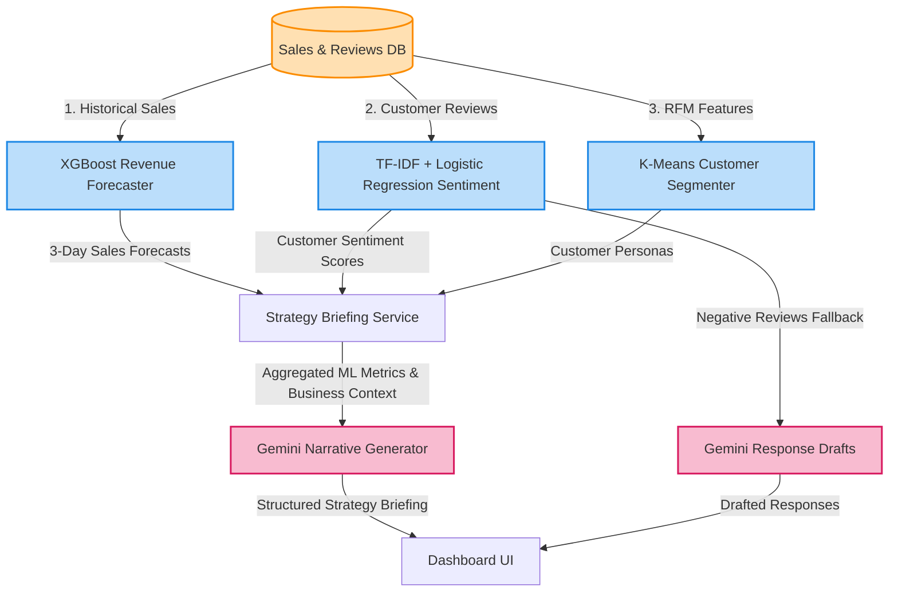
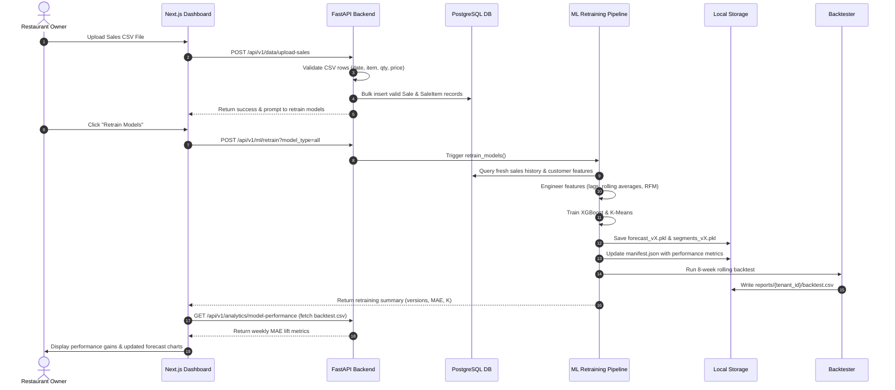

# OpsMind AI - System Architecture

## Table of Contents
1. [Overview](#overview)
2. [System Architecture](#system-architecture)
3. [Machine Learning & AI Architecture](#machine-learning--ai-architecture)
4. [Database Schema](#database-schema)
5. [Multi-Tenant Isolation](#multi-tenant-isolation)
6. [API Structure](#api-structure)
7. [Security Architecture](#security-architecture)
8. [Data Flow Examples](#data-flow-examples)
9. [Performance Considerations](#performance-considerations)
10. [Deployment & Scaling](#deployment--scaling)
11. [Testing Strategy](#testing-strategy)
12. [Next Steps](#next-steps)

---

## Overview

OpsMind AI is a **Multi-Tenant SaaS Platform** that combines:
- **Backend**: FastAPI (async) with SQLAlchemy 2.0
- **Frontend**: Next.js 14 with TypeScript & Tailwind CSS
- **Predictive Engine**: XGBoost Regressor (forecasting), scikit-learn K-Means (segmentation), and scikit-learn Logistic Regression (local sentiment)
- **AI Reasoning & Narrative Layer**: Google Gemini 1.5 Flash for strategy narratives and response drafts
- **Database**: PostgreSQL with async support
- **Authentication**: JWT-based with role-based access control

**Purpose**: Empower restaurant owners with data-driven intelligence and autonomous AI recommendations for operational optimization.

---

## System Architecture

OpsMind AI utilizes a multi-layered async architecture designed to ensure strict multi-tenant isolation, high performance under concurrent requests, and clean separation of concerns.

```mermaid
graph TD
    subgraph Client Layer (Next.js 14)
        UI[Glassmorphic Dashboard UI]
        MenuUI[Menu CRUD UI]
        PerfUI[Model Performance Dashboard]
    end

    subgraph API Gateway & Security Layer (FastAPI)
        Auth[JWT Authentication Gateway]
        RBAC[Three-Tier RBAC Guard]
    end

    subgraph Business Logic Layer (Python Services)
        ForecastSvc[Revenue Forecast Service]
        SentimentSvc[Sentiment & Reputation Service]
        PersonaEng[Persona Engine Clustering]
        AIStrategy[AI Consultant Briefing]
    end

    subgraph Machine Learning & AI Core
        XGB[XGBoost Forecasting Model]
        LogReg[TF-IDF + Logistic Regression Sentiment]
        KMeans[K-Means Customer Segmentation]
        Gemini[Google Gemini Narrative Layer]
    end

    subgraph Persistence Layer
        DB[(PostgreSQL Database)]
        Cache[(In-Memory Cache)]
    end

    UI -->|JWT Bearer Token / REST| Auth
    Auth -->|Authorize Access| RBAC
    RBAC -->|Route Request| ForecastSvc
    RBAC -->|Route Request| SentimentSvc
    RBAC -->|Route Request| PersonaEng
    RBAC -->|Route Request| AIStrategy

    ForecastSvc -->|Compute Lag Features| XGB
    SentimentSvc -->|Local Prediction| LogReg
    PersonaEng -->|RFM Clustering| KMeans
    AIStrategy -->|Translate Metrics into Narrative| Gemini

    ForecastSvc --> DB
    SentimentSvc --> DB
    PersonaEng --> DB
    
    ForecastSvc -.-> Cache
```

---

## Machine Learning & AI Architecture

Instead of utilizing Google Gemini for direct numerical forecasting or sentiment classification, OpsMind AI features a hybrid architecture. It combines local, specialized machine learning models for forecasting, classification, and segmentation, and uses Google Gemini purely for contextual natural-language explanation and response drafting.

### AI/ML Hybrid System Architecture

The following diagram illustrates how the local machine learning models perform the core calculations and classifications, passing their output metrics to the Google Gemini narrative layer for strategy generation and response drafts:



### 1. Core Machine Learning Pipelines

#### **XGBoost Revenue Forecaster (`Heart`)**
- **Model Type**: XGBoost Regressor with time-series feature engineering.
- **Features**: Lag revenue (1, 7, and 14 days), rolling averages, calendar components (day of week, month), and OpenWeatherMap context.
- **Metrics**: MAE: 642.04 (34% improvement over naive baseline), Stability Ratio: 12.92%.

#### **TF-IDF + Logistic Regression Sentiment Classifier (`Ears`)**
- **Model Type**: scikit-learn Pipeline (TF-IDF Vectorizer + Logistic Regression classifier).
- **Inference Flow**: Customer reviews are processed locally and instantly. Google Gemini is utilized purely for creative text generation—specifically, generating response drafts for negative reviews (sentiment < 0.0), rather than classification.
- **F1 Score**: 0.757 on holdout reviews.

#### **K-Means Customer Segmentation (`Persona Engine`)**
- **Model Type**: scikit-learn K-Means clustering.
- **Features**: Order frequency (90 days), average spend, recency (days), top menu category, total items ordered, and average items per order.
- **Centroids**: Silhouette-tuned cluster selection (3 to 6 clusters) with dynamic centroid labeling mapping to personas (e.g., "VIP Regular", "Occasional Visitor", "Big Spender", "At-Risk").

---

### 2. Model Versioning, Manifest System, and Scheduler

#### **Model Versioning & Storage**
All tenant-specific models are trained on-demand and stored under isolated directory paths:
`models/{tenant_id}/`
- Forecaster models are saved as `forecast_v{version}.pkl`.
- Segmentation models are saved as `segments_v{version}.pkl`.
- Versions are tracked as sequential increments (v1, v2, v3, etc.).

#### **Manifest System**
A metadata manifest file (`models/{tenant_id}/manifest.json`) is updated atomically upon each model save:
```json
{
  "tenant_id": 1,
  "last_trained": "2026-06-20T00:25:00Z",
  "forecast": {
    "version": "v1",
    "mae": 642.04,
    "path": "models/1/forecast_v1.pkl"
  },
  "segmentation": {
    "version": "v1",
    "path": "models/1/segments_v1.pkl"
  },
  "retrain_reason": "scheduled"
}
```

#### **Conditional Retraining Scheduler**
- **Trigger Mechanism**: A background scheduler running on a cron cycle compares the `last_trained` timestamp inside the tenant's `manifest.json` against the timestamps of newly added sales transactions in the database.
- **Execution Flow**:
```
Scheduler Check
     │
     ├──► Tenant has new sales since last_trained? ────► NO  ──► Skip
     │
     └──► YES ──► Trigger Retraining Pipeline
                       │
                       ├──► Extract features
                       ├──► Train XGBoost & K-Means models
                       ├──► Save models & update manifest.json
                       ├──► Execute 8-week rolling backtest
                       ├──► Generate reports/{tenant_id}/backtest.csv
                       └──► Invalidate in-memory caches
```

---

## Database Schema

### Core Tables (Multi-Tenant Foundation)

#### **tenants** (Parent table)
- `id` (PK)
- `name` (Restaurant name)
- `domain` (Custom domain)
- `created_at`, `updated_at`

#### **users** (Multi-tenant users with RBAC)
- `id` (PK)
- `tenant_id` (FK → tenants)
- `email` (unique within tenant)
- `hashed_password`
- `role` (Enum: OWNER, MANAGER, STAFF) — Day 25 RBAC
- `is_active` (soft delete)
- `created_at`, `updated_at`

### Business Objects

#### **menu_items**
- `id` (PK)
- `tenant_id` (FK → tenants)
- `name`, `description`, `price`
- `category_id` (FK → categories)
- `cost_of_goods` (for margin calculation)
- `is_active`

#### **sales**
- `id` (PK)
- `tenant_id` (FK → tenants)
- `total_amount`, `tax_amount`
- `payment_method` (Enum)
- `timestamp` (when sale occurred)
- Multi-relationship: `sale_items`

#### **sale_items**
- `id` (PK)
- `sale_id`, `menu_item_id`, `quantity`
- `unit_price_at_sale` (immutable for history)

#### **customers** (Day 24 JSONB)
- `id` (PK)
- `tenant_id` (FK → tenants)
- `name`, `email`
- `total_spent_inr` (LTV calculation)
- `visit_count`
- `preferences` (JSONB: favorite_items, allergies, dietary, seating, spice_level)

#### **recommendations** (Day 14 Feedback Loop)
- `id` (PK)
- `tenant_id` (FK → tenants)
- `description` (AI suggestion text)
- `status` (pending, accepted, rejected, implemented)
- `impact_rating` (ROI of the suggestion)
- `actual_impact` (measured revenue change)

### Supporting Tables

#### **categories**, **recipes**, **ingredients**, **staff**, **shifts**, **reviews**, **ai_cache**

---

## Multi-Tenant Isolation

### Isolation Strategy

1. **Database Level**
   - All queries filtered by `tenant_id`
   - Foreign keys ensure cross-tenant data cannot be mixed
   - Indexes on `tenant_id` for fast filtering

2. **Application Level (API Gates)**
   - JWT claims include `tenant_id`
   - Every endpoint validates JWT tenant matches requested resource
   - `get_current_user()` dependency extracts tenant_id from JWT

3. **Data Access Layer**
   - All SQLAlchemy queries include `.where(Model.tenant_id == user.tenant_id)`
   - Prevents accidental data leakage
   - Example:
     ```python
     # ❌ WRONG - Could leak other tenants' data
     result = await db.execute(select(Sale))
     
     # ✅ RIGHT - Scoped to user's tenant
     result = await db.execute(
         select(Sale).where(Sale.tenant_id == user.tenant_id)
     )
     ```

### Guarantee
**Restaurant A cannot see Restaurant B's data**, even if a user somehow gets a valid JWT from a different restaurant.

---

## API Structure

### Authentication Routes
```
POST   /api/v1/auth/register       → Create new user + tenant
POST   /api/v1/auth/login          → Get JWT token
POST   /api/v1/auth/refresh        → Renew access token
```

### Customer Intelligence (Day 24)
```
GET    /api/v1/customers/{id}/briefing    → 3-bullet cheat sheet for staff
```

### Menu Management
```
GET    /api/v1/menu                       → List all menu items
POST   /api/v1/menu                       → Create menu item
GET    /api/v1/menu/{id}                  → Get menu item details
PATCH  /api/v1/menu/{id}                  → Update menu item
DELETE /api/v1/menu/{id}                  → Delete menu item
```

### Sales & Transactions
```
POST   /api/v1/sales                      → Record sale
GET    /api/v1/sales                      → Get sales history
```

### Analytics & AI Insights
```
GET    /api/v1/analytics                  → Overall metrics
GET    /api/v1/analytics/ai-briefing      → AI strategy recommendations
GET    /api/v1/analytics/revenue-forecast → 3-day revenue prediction
GET    /api/v1/analytics/daily-tip        → Weather-optimized promotion
GET    /api/v1/analytics/model-performance → Model performance metrics
```

### Recommendation Tracking (Day 14)
```
GET    /api/v1/recommendations            → List all recommendations
POST   /api/v1/recommendations            → Record new recommendation
PATCH  /api/v1/recommendations/{id}       → Mark as accepted/rejected
GET    /api/v1/recommendations/{id}/verify-impact → ROI measurement
```

---

## Security Architecture

### Authentication Flow
```
1. User registers: email + password
   ↓
2. Password hashed with bcrypt (10 rounds)
   ↓
3. User login: verify password
   ↓
4. JWT generated:
   Header: {alg: HS256, typ: JWT}
   Payload: {sub: email, tenant_id, role, exp, iat}
   Signature: HMAC-SHA256(secret)
   ↓
5. Frontend stores in localStorage
   ↓
6. Every request: Authorization: Bearer {token}
   ↓
7. Backend verifies token signature + exp date
   ↓
8. Extract user from database (fresh state)
   ↓
9. Check is_active flag + role permission
```

### Authorization (RBAC - Day 25)
```
OWNER:
├─ View all financial data (profit, margins, costs)
├─ Modify menu prices and items
├─ Manage users and staff
├─ Access all analytics and AI insights
└─ Accept/reject AI recommendations

MANAGER:
├─ View operational analytics
├─ Manage inventory and staff schedules
├─ View AI insights (limited financial data)
└─ No user management

STAFF:
├─ View dashboard (sales overview only)
├─ Manage current orders and tables
├─ Access menu for order taking
└─ No financial or admin access
```

### Role Protection Example
```python
# Only OWNER/MANAGER can see profit margins
@router.get(
    "/analytics/profit",
    dependencies=[Depends(role_required(UserRole.OWNER, UserRole.MANAGER))]
)
async def get_profit_analysis(user: User = Depends(get_current_user)):
    # If STAFF tries to access → 403 Forbidden
    pass
```

---

## Data Flow Examples

### Example 1: Restaurant Owner Checks AI Strategy
```
1. Owner clicks "Ask OpsMind" button
2. Frontend: GET /api/v1/analytics/ai-briefing (with JWT)
3. Backend:
   - Verify JWT token + extract tenant_id
   - Fetch sales data for this tenant (last 30 days)
   - Calculate: revenue, profit, margins, top items
   - Call Gemini AI with structured prompt
   - Parse AI response (JSON validation)
   - Return briefing with strategy recommendations
4. Frontend: Display 5-section briefing (star dish, price rec, etc.)
```

### Example 2: Waiter Gets Customer Briefing
```
1. Waiter scans customer ID code
2. Frontend: GET /api/v1/customers/1/briefing (with JWT)
3. Backend:
   - Fetch customer profile (LTV, visit count, preferences JSONB)
   - Fetch customer's order history
   - Call AI persona engine
   - Generate: persona, reasoning, suggested action
4. Frontend: Display 3-bullet cheat sheet
   - LTV: ₹5,400
   - Favorite: Paneer Chilly
   - AI: [High-Value Regular] Offer new Malai Kofta...
5. Waiter delivers personalized greeting
```

### Example 3: Restaurant Owner Uploads Sales CSV and Retrains Models



1. Owner uploads sales CSV file in Next.js Frontend settings dashboard.
2. Frontend: `POST /api/v1/data/upload-sales` (multipart form-data with JWT).
3. Backend:
   - Validates columns (date, item_name, quantity, unit_price, total_amount, customer_id).
   - Inserts valid sales rows scoped to tenant_id into database.
   - Triggers or prompts model retraining to incorporate the new data.
4. Owner/System triggers retraining: `POST /api/v1/ml/retrain?model_type=all`
5. Backend Retraining Pipeline:
   - Queries database for the latest sales data.
   - Engineers features (lag features, rolling averages).
   - Retrains the XGBoost Forecasting model and K-Means Segmentation model.
   - Saves model files as `forecast_v{new_version}.pkl` and `segments_v{new_version}.pkl`.
   - Writes training metadata to `models/{tenant_id}/manifest.json` with retrain_reason set to "manual".
   - Runs `run_backtest(tenant_id)` generating an 8-week weekly performance log.
   - Saves backtest report to `reports/{tenant_id}/backtest.csv`.
   - Invalidates local in-memory forecaster caches.
6. Frontend: Mutates the performance data SWR cache.
7. Model Performance Dashboard displays fresh metrics: overall MAE lift (+34%), stability status (PASSED), and weekly logs table.

---

## Performance Considerations

### Indexing Strategy
- `(tenant_id, email)` on users table (multi-tenant lookup)
- `(tenant_id, created_at)` on sales table (time-based analytics)
- `role` on users table (RBAC filtering)

### Caching
- Gemini API responses cached with 1-hour TTL
- Weather data cached for 30 minutes
- Mathematical calculations cached

### Async Architecture
- All database queries use `AsyncSession`
- All API endpoints are async
- Parallel processing for multiple AI calls

---

## Deployment & Scaling

### Deployment Targets
- **Backend**: Docker container on Render/Railway/AWS ECS
- **Frontend**: Vercel (Next.js optimized)
- **Database**: Managed PostgreSQL (AWS RDS, Heroku Postgres, Supabase)
- **AI**: Google Gemini API (SaaS)

### Scaling Considerations
- Database: Connection pooling for concurrent requests
- Cache: Redis for distributed caching
- Queue: Celery for async AI tasks
- CDN: CloudFront for frontend static assets

---

## Testing Strategy

- **Unit Tests**: Per-service testing
- **Integration Tests**: API endpoint testing
- **Security Tests**: RBAC enforcement, SQL injection prevention
- **Load Tests**: Concurrent user simulation

---

## Next Steps (Future Architecture)

- **Day 26**: Recommendation Feedback Loop Enhancement
- **Day 27**: Team Coordination & AI Scheduling
- **Day 28**: Advanced Loyalty Program with AI
- **Day 30**: Real-time Websocket dashboards
