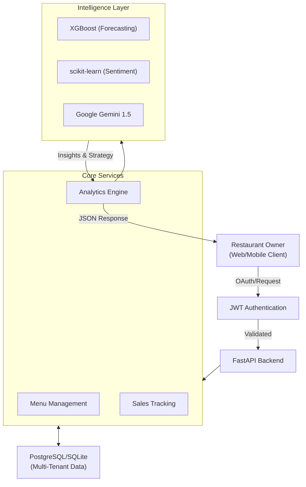

<div align="center">
  <h1>OpsMind AI</h1>
  <p><strong>Restaurant Operations Intelligence System</strong></p>
  <p><i>Powered by Multi-Tenant SaaS Architecture & Agentic AI</i></p>

  <div>
    
    
    
    
    
  </div>
</div>

---

## Vision

OpsMind AI is a cutting-edge SaaS platform designed for restaurant owners and operators to harness data-driven intelligence for real-time operational optimization. Using a multi-tenant architecture, advanced analytics, and autonomous AI agents, we empower restaurants to:

- **Track Operations in Real-Time** — Monitor sales, inventory, and staffing with zero latency.
- **Deploy Hybrid ML + AI Core** — Local ML models (XGBoost, scikit-learn) generate hard metrics, while Gemini provides narrative reasoning.
- **Generate AI Insights** — Intelligent recommendations for pricing, labor, and menu optimization.
- **Forecast Revenue** — Predictive analytics for 3-day revenue forecasting.
- **Optimize Pricing** — Simulate price changes and analyze their impact on margins.

---

## Core Capabilities

### Enterprise Multi-Tenancy
- **Isolated Data Architecture:** Secure JWT-based authentication ensuring complete data isolation per restaurant.
- **Role-Based Access Control (RBAC):** Three-tier hierarchy (OWNER, MANAGER, STAFF) with strict permission guards.

### Hybrid AI Intelligence
- **Revenue Forecaster (XGBoost):** Predicts the next 3 days of sales with confidence scores grounded in statistical trend analysis.
- **Customer Sentiment Engine (scikit-learn):** Processes customer feedback locally using TF-IDF and Logistic Regression.
- **Strategy Agent (Gemini 2.0 Flash):** Evaluates performance metrics and translates machine learning patterns into high-level business advice.

### "The Pass" Design System
- **Enterprise-Grade Dashboard:** Next.js frontend featuring the custom "The Pass" design aesthetic.
- **Dynamic CSS Variables:** Deep slate backgrounds, electric blue accents, and sharp ticket-style cards for a premium feel.
- **Real-Time Data Visualization:** Dual-series AreaCharts and BarCharts built with Recharts.

---

## Tech Stack

| Domain | Technology | Description |
|--------|-----------|-------------|
| **Backend** | FastAPI (Python) | Async, type-safe, auto-generated OpenAPI documentation |
| **Database** | PostgreSQL / SQLite | SQLAlchemy 2.0 ORM with async connection pooling (`asyncpg`) |
| **Auth** | JWT | Secure access token + refresh token pattern |
| **AI Engine** | XGBoost, scikit-learn, Gemini | ML for forecasting/segmentation, Gemini for strategy narrative |
| **Frontend** | Next.js 16, React 19 | App Router, Server Components, TypeScript |
| **Styling** | Tailwind CSS | Utility-first CSS with a custom dynamic theme |
| **Data Fetching**| Axios + SWR | Authenticated HTTP client with intelligent client-side caching |

---

## Full-Stack Architecture Flow


```mermaid
graph TB
    User["Restaurant Owner<br/>(Web/Mobile Client)"]
    Auth["JWT Authentication"]
    FastAPI["FastAPI Backend"]
    
    subgraph CoreServices [Core Services]
        Menu["Menu Management"]
        Sales["Sales Tracking"]
        Analytics["Analytics Engine"]
    end
    
    Database["PostgreSQL/SQLite<br/>(Multi-Tenant Data)"]
    
    subgraph IntelligenceLayer [Intelligence Layer]
        XGB["XGBoost (Forecasting)"]
        Sklearn["scikit-learn (Sentiment)"]
        Gemini["Google Gemini 1.5"]
    end
    
    User -->|OAuth/Request| Auth
    Auth -->|Validated| FastAPI
    FastAPI --> CoreServices
    CoreServices <--> Database
    Analytics --> IntelligenceLayer
    IntelligenceLayer -->|Insights & Strategy| Analytics
    Analytics -->|JSON Response| User
```

---

## Database Schema

The system uses a robust 12-table relational schema. **All tables are strictly scoped by `tenant_id` for complete data isolation.**

1. `tenants` — Restaurant organizations (parent)
2. `users` — Staff/managers with JWT auth
3. `categories` — Menu organization structure
4. `menu_items` — Dishes with pricing & costs
5. `ingredients` — Raw materials with unit costs
6. `recipes` — Menu item ↔ Ingredient mapping
7. `sales` — Completed transactions/bills
8. `sale_items` — Line items within transactions
9. `reviews` — Customer feedback & AI sentiment
10. `staff` — Employee records & hourly rates
11. `shifts` — Work shifts & cost calculations
12. `recommendations` — AI suggestions with impact tracking

---

## Getting Started

### 1. Backend Setup

**Prerequisites:** Python 3.10+, PostgreSQL 14+ (or SQLite3)

```bash
# Create and activate virtual environment
python -m venv .venv
source .venv/bin/activate  # Windows: .venv\Scripts\activate

# Install dependencies
pip install -r requirements.txt

# Create database tables and seed demo data
python scripts/seed_data.py

# Start the API server
uvicorn app.main:app --reload
```
*Visit `http://localhost:8000/docs` for the interactive API documentation.*

### 2. Frontend Setup

**Prerequisites:** Node.js 18+

```bash
# Navigate to frontend directory
cd frontend

# Install dependencies
npm install

# Start the development server
npm run dev
```
*Visit `http://localhost:3000` to access the Dashboard UI.*

### 3. Environment Configuration

Create a `.env` file in the root directory:

```env
# Database
DATABASE_URL=sqlite+aiosqlite:///./opsmind_demo.db

# JWT Security
SECRET_KEY=generate-a-strong-secret-key-here
DEBUG=True
ENVIRONMENT=development

# AI/ML APIs
GEMINI_API_KEY=your-gemini-api-key-here
OPENWEATHER_API_KEY=your-openweather-api-key-here

# Application
APP_NAME=OpsMind AI
APP_VERSION=1.0.0
CORS_ORIGINS=["http://localhost:3000", "http://localhost:8000"]
```

---

## Model Performance & Evaluation

OpsMind AI features a comprehensive model backtesting pipeline that continuously measures the XGBoost forecaster performance against a naive baseline over a rolling 8-week window.

- **Data Import:** Send historical sales records via `POST /api/v1/data/upload-sales`
- **Model Retraining:** Trigger retraining on-demand via `POST /api/v1/ml/retrain?model_type=all`

*Current Benchmark:* Forecasting MAE demonstrates a **+34.0% performance lift** over naive baseline predictions.

---

## Local Quality Checks

Maintain high code quality with our standardized local checks:

```bash
# Backend linting & formatting
flake8 app
black app --check

# Run unit & integration tests
python -m pytest tests -v

# Frontend linting
cd frontend && npm run lint
```

---

## License & Contributing

This project is licensed under the **MIT License** — See the [LICENSE](LICENSE) file for details.

1. Fork the repo
2. Create a feature branch (`git checkout -b feature/amazing-feature`)
3. Commit changes (`git commit -m "feat: add amazing feature"`)
4. Push to branch (`git push origin feature/amazing-feature`)
5. Open a Pull Request

---

<div align="center">
  <p>Built by <a href="https://github.com/taksh1507">Taksh Gandhi</a></p>
  <p>Contact: taskshgandhi4@gmail.com</p>
</div>
